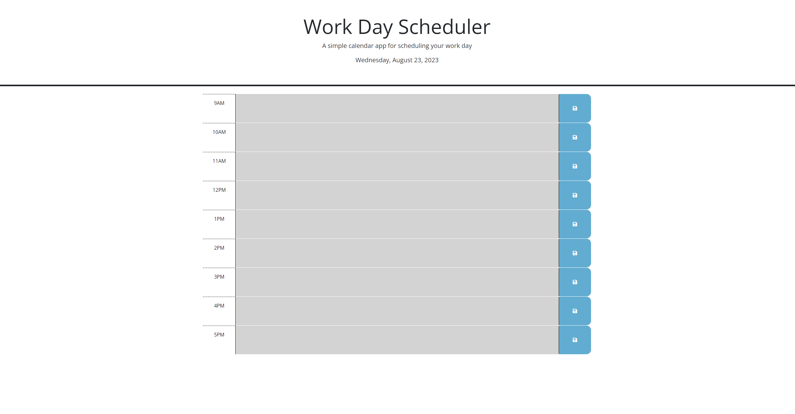

# Planner App
An application to organize and plan my day. The fifth assignment in my coding bootcamp.

## Description
This webpage is used to organize events throughout the work day. It displays the date in the header, and timeblocks for every hour in the standard work day (9am-5pm). The timeblocks are color-coded for past, present, and future, based on the time of day.

## Usage
To use this webpage, first navigate to [Planner App](https://andreasq99.github.io/Planner-App/). The webpage will automatically populate each timeblock with any previously saved events on your schedule. To add a new item to the schedule, click the desired timeblock, type in the details of the event, and then click the save icon on the right side. This event will then be saved in this timeblock until you edit it or delete the local storage tied to this webpage.

## License
This webpage uses the MIT license.